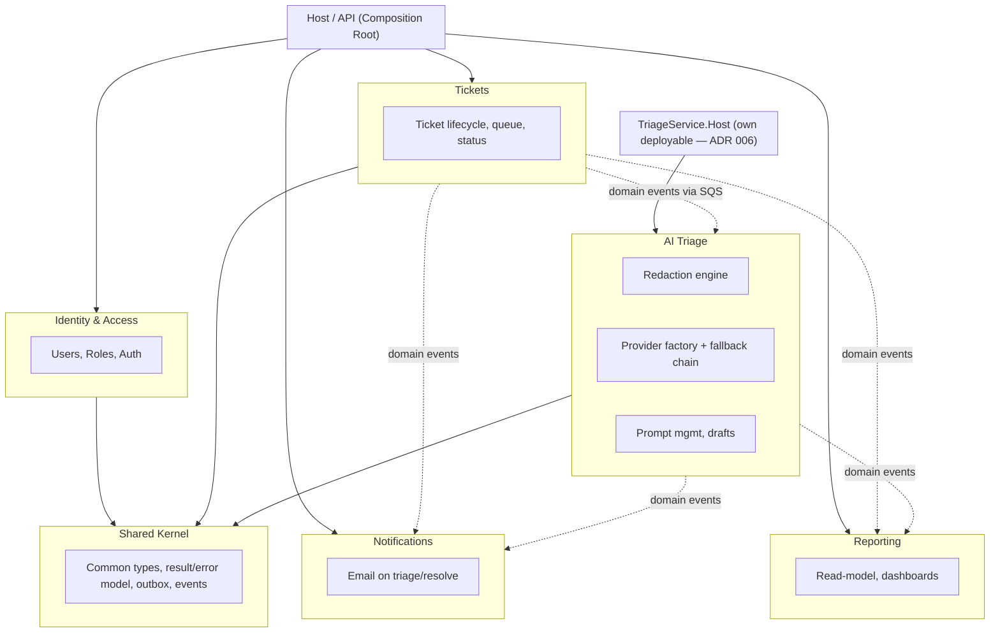

# Ticket Triage

A support ticket triage platform: agents create and work tickets, an async pipeline
redacts PII and runs AI triage (locally by default, or via an opt-in cloud provider
with automatic local fallback), and the result — category, priority, summary, draft
reply — shows up on the ticket with the provider that produced it clearly labeled.

Built as a .NET 8 modular monolith + Angular frontend, following the staged delivery
plan in [`docs/architecture-plan.md`](docs/architecture-plan.md). **Stage 0 (the MVP)
is complete**, plus **Add-on A** (multi-provider resilience: bulkhead concurrency
limiting, per-provider telemetry, per-user provider preference, org-wide force-local-only
policy), **Add-on B** (OpenTelemetry tracing/metrics, security headers, Redis-backed
triage result caching with an in-memory fallback), **Add-on C** (Notifications and
Reporting modules), **Add-on D** (a live-verified WCAG 2.1 AA accessibility pass,
ADRs, and presentation polish), stretch stage **S1** (Triage extracted into its own
deployable, `src/TriageService/TriageService.Host` — see ADR 006), and stretch stage
**S2** (an LLM eval harness, `tools/Triage.Eval`, scoring fixed sample tickets for
category/priority/summary quality per provider), stretch stage **S3** (a
concurrent-ingestion load test — see
[`docs/load-test-report.md`](docs/load-test-report.md)), and stretch stage **S4**
(RFCs for the decisions that had real alternatives — see [`docs/rfc`](docs/rfc)) —
see the plan for what's still optional (stretch stages S5–S7).

## Architecture



**Rule:** modules only talk to each other through the other module's `*.Contracts`
project or async domain events — never another module's `Domain`/`Application`/
`Infrastructure` directly. This is enforced by a NetArchTest suite in
`tests/ArchitectureTests` that fails CI on a violation, not just a code-review nit.

## Why these choices

- **Modular monolith over microservices.** Started as one deployable with strict
  internal boundaries via per-module `Contracts` projects, so extracting a module
  to its own service later means cutting along a seam that already exists, not a
  rewrite — stretch stage S1 (Triage's extraction, ADR 006) is that seam actually
  getting cut.
- **Local-first LLM, redact always, cloud is opt-in.** Every ticket is redacted by
  a Presidio (deterministic regex/NER) + Ollama (contextual free-text) union pass
  before any triage call — local or cloud. A cloud provider is only used if the
  agent explicitly opts in for that ticket, and every triaged ticket visibly shows
  which provider actually produced the result, including when local fallback
  silently kicked in after a cloud failure.
- **Outbox + async triage over synchronous inline calls.** `POST /tickets` returns
  immediately; a background worker consumes `TicketCreated` off SQS, redacts, and
  triages. A slow LLM call — local or cloud — never holds an HTTP request open.
- **Trunk-based branching, promote-forward deploys.** See §15 of the plan.
- **Environments are provisioned on demand via Terraform and torn down after use.**
  Not a limitation — see §14/§21 of the plan for the cost reasoning.

## Repository layout

```
/src
  /Host                 ASP.NET Core Web API — composition root for Identity/Tickets/Notifications/Reporting
  /TriageService/Host    Standalone deployable for the Triage module (see docs/adr/006)
  /Modules/{Tickets,Triage,Identity,Notifications,Reporting}/*.{Domain,Application,Infrastructure,Contracts}
  /Shared/{Shared.Kernel,Shared.Abstractions,Shared.Infrastructure}
/tests
  /UnitTests             xUnit + NSubstitute + FluentAssertions
  /ArchitectureTests      NetArchTest — module boundary + framework-purity rules
  /IntegrationTests       WebApplicationFactory + Testcontainers (scaffolded, see below)
/tools/Triage.Eval      LLM eval harness — fixed sample tickets scored per provider (S2)
/loadtest               Concurrent ticket-ingestion load test (S3, see docs/load-test-report.md)
/frontend/apps/agent-console   Angular 18 standalone app (signals, no NgRx)
/infra/terraform        Per-environment AWS infra (VPC, ECS Fargate, RDS, SQS, S3/CloudFront)
/infra/localstack       SQS queue bootstrap script for local dev
docker-compose.yml      Full local stack in one command
```

## Running locally

```bash
docker compose up
```

This brings up Postgres, LocalStack (SQS), Ollama (pulls `llama3.1` on first start),
Microsoft Presidio, Redis, the API, the standalone Triage service, and the Angular
dev server. First run takes a few minutes while Ollama pulls its model; subsequent
runs are fast.

- API: http://localhost:5000 (Swagger at `/swagger` in Development)
- Frontend: http://localhost:4200
- The Triage service (`src/TriageService/TriageService.Host`) has no HTTP surface
  besides health checks — it's a pure SQS consumer/producer, so there's no port to
  browse to; it shows up in `docker compose ps`/logs as `triage-service`.
- A seed admin account is created on first boot from
  `Identity:SeedAdmin:Email` / `Identity:SeedAdmin:Password`
  (defaults in `appsettings.Development.json`: `admin@ticket-triage.local` /
  `ChangeMe123!` — dev-only, not a real secret, change before any shared deploy).

### Running the backend without Docker

`dotnet run --project src/Host` and `dotnet run --project
src/TriageService/TriageService.Host` (run both — Tickets and Triage are separate
deployables now, see docs/adr/006) work against a Postgres/LocalStack/Ollama/Redis
you run yourself (e.g. via `docker compose up postgres localstack ollama
presidio-analyzer redis`), which is faster for iterating without a full image
rebuild.

### Running the frontend without Docker

```bash
cd frontend/apps/agent-console
npm ci
npm start
```

## Testing

```bash
# Backend
dotnet test tests/ArchitectureTests
dotnet test tests/UnitTests/Tickets.Tests tests/UnitTests/Triage.Tests tests/UnitTests/Identity.Tests \
  tests/UnitTests/Notifications.Tests tests/UnitTests/Reporting.Tests tests/UnitTests/Triage.Eval.Tests

# Frontend
cd frontend/apps/agent-console
npm run lint
npm run test:ci
```

### Triage eval harness (stretch stage S2)

`tools/Triage.Eval` runs ~30 fixed sample tickets (`tools/Triage.Eval/samples.json`, 8 per
category across billing/technical/account/general with a mixed priority spread) through a real
provider and scores category/priority accuracy plus a summary-keyword-overlap heuristic, exiting
non-zero if any threshold isn't met:

```bash
dotnet run --project tools/Triage.Eval -- --provider local   # or openai / anthropic / gemini
```

`tests/UnitTests/Triage.Eval.Tests` covers the scoring math and sample-data quality (unique IDs,
valid categories/priorities, every category represented) without needing a live LLM call.
`.github/workflows/triage-eval.yml` runs it against a real Ollama on `workflow_dispatch` or
whenever the prompt/provider code changes — not part of the required `ci.yml` gate, since pulling
a model on every push is too slow/costly for that. This sandbox's egress policy blocks pulling
the `ollama/ollama` image, so the workflow was written and reviewed but not executed live here;
the tool itself was run against `--provider local` here and confirmed to load all 32 samples and
fail cleanly at the expected boundary (connection refused — no Ollama in this sandbox), the same
verified-failure-mode pattern used for the Testcontainers integration tests below.

`tests/IntegrationTests/Tickets.IntegrationTests` boots the real Host via
`WebApplicationFactory` against a Testcontainers Postgres instance and drives real HTTP
requests through auth + MediatR + EF Core + the outbox. It compiles and its failure mode
was verified here (Docker image pulls are policy-blocked in this sandbox, so it fails
cleanly at container startup rather than passing) — it should run in any environment
with normal Docker Hub access, including GitHub Actions, but wasn't seen green in this
session.

`frontend/apps/agent-console/e2e` has a Playwright + axe-core accessibility suite
(WCAG 2.1 A/AA) covering every authenticated page — login, ticket queue, ticket
detail, provider settings, org policy, user management, reporting. It needs the
full stack running (see `e2e/README.md`), so it's not wired into CI, but it *was*
run here against a live API + Angular dev server: **zero violations, at any
impact level, on every page.**

```bash
cd frontend/apps/agent-console
npm run e2e
```

## What's implemented (Stage 0 + Add-ons A/B/C/D) vs. what's a documented follow-up

**Implemented and verified working end-to-end** (see the ADRs and the plan for
detail): login/JWT/refresh with role+permission-based authorization, ticket
CRUD/queue/resolve/assign, the outbox pattern publishing to SQS, PII redaction
(Presidio + Ollama union with defensive bounds-checking), the local-first
triage pipeline with a fallback-to-local decorator around a keyed multi-provider
client factory (Ollama live-tested; OpenAI/Anthropic/Gemini implemented against
each provider's documented API but not live-called in this environment), health
checks, correlation IDs, rate limiting, CORS, structured logging, and the Angular
console (login, queue, ticket detail with triage/provider badges, admin user
creation) — all driven through a real browser against the real API during
development, not just unit-tested.

**Add-on A (multi-provider + resilience depth):** a shared Polly bulkhead limits
total concurrent triage calls across every provider (so a ticket burst can't
starve the local GPU or the API's thread pool); per-provider telemetry counters/
histograms (`triage.attempts`, `triage.duration`, tagged by provider/fallback/
outcome) via `System.Diagnostics.Metrics`; per-user provider preference and an
Admin-only org-wide force-local-only policy, both live-verified end-to-end
(preference persists and is honored on ticket creation; org policy correctly
overrides a user's cloud preference) through the API and the new Angular
settings pages.

**Add-on B (observability + hardening):** OpenTelemetry tracing (ASP.NET Core +
HttpClient + EF Core spans, including `TriageMetrics`' counters as an OTel
meter) exporting to the console locally or an OTLP collector when configured —
live-verified: real trace spans (including the EF Core `ticket_triage` DB span)
appear in the console during a live run; a `SecurityHeadersMiddleware` adding
CSP/X-Frame-Options/X-Content-Type-Options/Referrer-Policy/HSTS, live-verified
via response headers, with a relaxed CSP in Development only so Swagger UI's
inline assets still work; Redis-backed caching of triage results keyed on the
already-redacted ticket text (so a duplicate ticket skips a redundant LLM
call), falling back to an in-memory `IDistributedCache` when no Redis
connection string is configured — verified via unit tests against both the
cache contract and the in-memory implementation (no live Redis in this
sandbox); the Redis health check registers itself only when Redis is actually
configured, also live-verified (absent from `/health/ready` here, as
expected).

**Add-on C (Notifications & Reporting):** two new modules, both pure event
consumers with their own schema — no other module reaches into their data.
Notifications sends an email on `TicketTriaged`/`TicketResolved` (both events
extended to carry `CustomerEmail` as a passthrough, since neither module may
read the Tickets database directly), with per-(ticket, event-type) idempotency
via a `NotificationLog` table, and a logging-only `IEmailSender` fallback when
no SMTP host is configured (same fallback pattern as Redis/SQS) — live-verified
via the DB schema migrating correctly and unit tests covering send/idempotency/
missing-email behavior (no live SMTP in this sandbox). Reporting maintains an
incrementally-updated read-model row per ticket and exposes
`GET /api/reporting/summary` (ticket counts by status, average triage latency,
per-provider fallback breakdown) plus an Angular dashboard (stat tiles + a bar
chart) — live-verified end-to-end: the endpoint, its permission gate
(`reporting:view`; confirmed 403 for Agent, 200 for Admin), and the dashboard
page all work against the real API and render correctly in a real browser. The
architecture test suite now covers all 5 modules (62 cases, up from 20).

**Add-on D (presentation polish):** a Playwright + axe-core accessibility suite
covering every authenticated page, actually run against a live API + Angular
dev server rather than left as an aspiration — **zero WCAG 2.1 A/AA violations
at any impact level** on every page tested. ADR 005 documents the
graceful-fallback pattern used repeatedly across Add-ons B/C (Redis, SMTP,
SQS routes) once it recurred often enough to be worth naming. The
architecture diagram, module list, and this section were updated to reflect
Notifications/Reporting. No new AWS deploy or recorded video — this stage is
entirely about the repo, matching the plan's own scope for it.

**Stretch stage S1 (extract Triage as a standalone service):** the `Triage` module
now ships as its own deployable, `src/TriageService/TriageService.Host`, referencing
only `Triage.Application`/`Triage.Infrastructure`/`Shared.Infrastructure` — no
reference to Tickets/Identity/Notifications/Reporting. The main `Host` dropped its
Triage references, connection string, health check, and migration entirely. Because
Tickets↔Triage already communicated purely through the outbox/SQS (never
in-process — see ADR 006), the split required no protocol change, just a new entry
point, Dockerfile, appsettings surface, and a second Terraform `ecs-service` module
per environment. Live-verified here: the new service builds, migrates its schema
against a real Postgres, serves `/health/live` and `/health/ready` as healthy, and
the main Host still creates tickets end-to-end (201) with `triage-db` correctly
absent from its own `/health/ready` — all 62 architecture tests and 119 unit tests
still pass with the module boundary unchanged.

**Stretch stage S2 (LLM eval harness):** `tools/Triage.Eval` runs 32 fixed sample
tickets (8 each across billing/technical/account/general, mixed priorities) through
a real `ITriageLlmClient` and scores category accuracy, priority accuracy, and a
summary-keyword-overlap heuristic, exiting non-zero if any threshold isn't met — a
regression suite for AI output quality, not just a demo you eyeball once.
`tests/UnitTests/Triage.Eval.Tests` (15 tests) covers the scoring math and the
sample data's own integrity (unique IDs, valid category/priority vocabulary, every
category represented) independent of any live LLM call, and
`.github/workflows/triage-eval.yml` runs the harness against a real Ollama on
`workflow_dispatch` or whenever the prompt/provider code changes. Live-verified
here: the tool loads all 32 samples and reaches the network call before failing at
the expected boundary (no Ollama in this sandbox) — the same verified-failure-mode
pattern used for the Testcontainers integration tests below; the CI workflow itself
wasn't run live here since this sandbox's egress policy blocks pulling the
`ollama/ollama` image.

**Stretch stage S3 (load test):** [`loadtest/ticket-ingestion.js`](loadtest/ticket-ingestion.js)
(autocannon — k6 itself isn't installable here, see `loadtest/README.md`) drove real
concurrent load at `POST /api/tickets` against a locally-running Host, at 5/20/50/100
concurrent connections. **Finding:** the per-IP rate limiter (100 req/min, no queueing)
trips almost immediately under any sustained concurrent traffic — latency stayed in
single-digit milliseconds throughout, because the limiter rejects a request in-process
before it ever reaches the database. Full write-up, numbers, root cause, and the fix
I'd make (partition the limiter by authenticated user instead of IP for authenticated
routes) in [`docs/load-test-report.md`](docs/load-test-report.md), including a second,
incidental finding about the outbox dispatcher's unbounded retry-with-no-backoff
behavior observed during the same run.

**Documented but not exercised in this environment:** the Terraform modules are
written and pass `terraform fmt`/HCL review, but `terraform validate`/`plan`/`apply`
were not run here (the sandbox's egress policy blocks the Terraform Registry and
container registries) — review before a real `apply`. Multi-provider cloud triage
(OpenAI/Anthropic/Gemini) is implemented but untested against live provider APIs.
The async SQS-triggered paths for Notifications/Reporting/Triage caching couldn't
be driven end-to-end here (LocalStack/SQS isn't reachable in this sandbox, same
limitation as Stage 0) — covered by unit tests instead of a live run. The eval
harness's CI workflow (`triage-eval.yml`) wasn't run live for the same
Docker-image-pull reason. The load test could only exercise the synchronous ticket-
creation path — SQS queue depth, Ollama latency under concurrency, and the cloud
provider circuit breaker weren't observable here for the same reasons (see
`docs/load-test-report.md`'s "Scope and limitations"). Stretch stages S5–S7 are not
started.

**Stretch stage S4 (RFCs for decisions with real alternatives):** [`docs/rfc`](docs/rfc)
has three — redact-then-triage vs. triage-raw-and-redact-only-on-cloud-escalation
(the plan's own named example), synchronous inline triage vs. the outbox+async design
actually used, and how org policy/a per-ticket request/a user's standing provider
preference should resolve when they disagree. Each walks through the real
alternatives and their tradeoffs before landing on a recommendation — distinct from
an ADR, which records the outcome; an RFC shows the reasoning that got there.

## ADRs

See [`docs/adr`](docs/adr) for the reasoning behind the modular monolith, local-first
LLM strategy, PII redaction approach, branching strategy, the graceful-fallback
pattern used for optional infrastructure (Redis, SMTP), and extracting Triage into
its own deployable. See [`docs/rfc`](docs/rfc) for the RFCs written for decisions that
had genuine alternatives worth walking through explicitly.
