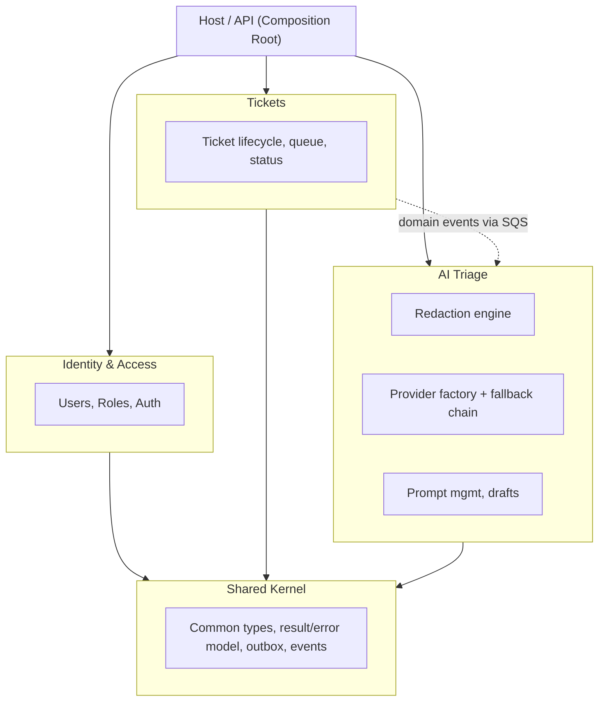

# Ticket Triage

A support ticket triage platform: agents create and work tickets, an async pipeline
redacts PII and runs AI triage (locally by default, or via an opt-in cloud provider
with automatic local fallback), and the result — category, priority, summary, draft
reply — shows up on the ticket with the provider that produced it clearly labeled.

Built as a .NET 8 modular monolith + Angular frontend, following the staged delivery
plan in [`docs/architecture-plan.md`](docs/architecture-plan.md). **Stage 0 (the MVP)
is complete**, plus depth from **Add-on A** (multi-provider resilience: bulkhead
concurrency limiting, per-provider telemetry, per-user provider preference, org-wide
force-local-only policy) — see the plan for what's still optional.

## Architecture



**Rule:** modules only talk to each other through the other module's `*.Contracts`
project or async domain events — never another module's `Domain`/`Application`/
`Infrastructure` directly. This is enforced by a NetArchTest suite in
`tests/ArchitectureTests` that fails CI on a violation, not just a code-review nit.

## Why these choices

- **Modular monolith over microservices.** One deployable, strict internal
  boundaries via per-module `Contracts` projects. Extracting a module to its own
  service later (see the plan's stretch stage S1) means cutting along a seam that
  already exists, not a rewrite.
- **Local-first LLM, redact always, cloud is opt-in.** Every ticket is redacted by
  a Presidio (deterministic regex/NER) + Ollama (contextual free-text) union pass
  before any triage call — local or cloud. A cloud provider is only used if the
  agent explicitly opts in for that ticket, and every triaged ticket visibly shows
  which provider actually produced the result, including when local fallback
  silently kicked in after a cloud failure.
- **Outbox + async triage over synchronous inline calls.** `POST /tickets` returns
  immediately; a background worker consumes `TicketCreated` off SQS, redacts, and
  triages. A slow LLM call — local or cloud — never holds an HTTP request open.
- **Trunk-based branching, promote-forward deploys.** See §15 of the plan.
- **Environments are provisioned on demand via Terraform and torn down after use.**
  Not a limitation — see §14/§21 of the plan for the cost reasoning.

## Repository layout

```
/src
  /Host                 ASP.NET Core Web API — composition root, DI wiring, middleware
  /Modules/{Tickets,Triage,Identity}/*.{Domain,Application,Infrastructure,Contracts}
  /Shared/{Shared.Kernel,Shared.Abstractions,Shared.Infrastructure}
/tests
  /UnitTests             xUnit + NSubstitute + FluentAssertions
  /ArchitectureTests      NetArchTest — module boundary + framework-purity rules
  /IntegrationTests       WebApplicationFactory + Testcontainers (scaffolded, see below)
/frontend/apps/agent-console   Angular 18 standalone app (signals, no NgRx)
/infra/terraform        Per-environment AWS infra (VPC, ECS Fargate, RDS, SQS, S3/CloudFront)
/infra/localstack       SQS queue bootstrap script for local dev
docker-compose.yml      Full local stack in one command
```

## Running locally

```bash
docker compose up
```

This brings up Postgres, LocalStack (SQS), Ollama (pulls `llama3.1` on first start),
Microsoft Presidio, the API, and the Angular dev server. First run takes a few
minutes while Ollama pulls its model; subsequent runs are fast.

- API: http://localhost:5000 (Swagger at `/swagger` in Development)
- Frontend: http://localhost:4200
- A seed admin account is created on first boot from
  `Identity:SeedAdmin:Email` / `Identity:SeedAdmin:Password`
  (defaults in `appsettings.Development.json`: `admin@ticket-triage.local` /
  `ChangeMe123!` — dev-only, not a real secret, change before any shared deploy).

### Running the backend without Docker

`dotnet run --project src/Host` works against a Postgres/LocalStack/Ollama you
run yourself (e.g. via `docker compose up postgres localstack ollama
presidio-analyzer`), which is faster for iterating on the API alone.

### Running the frontend without Docker

```bash
cd frontend/apps/agent-console
npm ci
npm start
```

## Testing

```bash
# Backend
dotnet test tests/ArchitectureTests
dotnet test tests/UnitTests/Tickets.Tests tests/UnitTests/Triage.Tests tests/UnitTests/Identity.Tests

# Frontend
cd frontend/apps/agent-console
npm run lint
npm run test:ci
```

`tests/IntegrationTests/Tickets.IntegrationTests` boots the real Host via
`WebApplicationFactory` against a Testcontainers Postgres instance and drives real HTTP
requests through auth + MediatR + EF Core + the outbox. It compiles and its failure mode
was verified here (Docker image pulls are policy-blocked in this sandbox, so it fails
cleanly at container startup rather than passing) — it should run in any environment
with normal Docker Hub access, including GitHub Actions, but wasn't seen green in this
session.

## What's implemented (Stage 0 + Add-on A) vs. what's a documented follow-up

**Implemented and verified working end-to-end** (see the ADRs and the plan for
detail): login/JWT/refresh with role+permission-based authorization, ticket
CRUD/queue/resolve/assign, the outbox pattern publishing to SQS, PII redaction
(Presidio + Ollama union with defensive bounds-checking), the local-first
triage pipeline with a fallback-to-local decorator around a keyed multi-provider
client factory (Ollama live-tested; OpenAI/Anthropic/Gemini implemented against
each provider's documented API but not live-called in this environment), health
checks, correlation IDs, rate limiting, CORS, structured logging, and the Angular
console (login, queue, ticket detail with triage/provider badges, admin user
creation) — all driven through a real browser against the real API during
development, not just unit-tested.

**Add-on A (multi-provider + resilience depth):** a shared Polly bulkhead limits
total concurrent triage calls across every provider (so a ticket burst can't
starve the local GPU or the API's thread pool); per-provider telemetry counters/
histograms (`triage.attempts`, `triage.duration`, tagged by provider/fallback/
outcome) via `System.Diagnostics.Metrics` — exported once Add-on B wires an
OpenTelemetry reader; per-user provider preference and an Admin-only org-wide
force-local-only policy, both live-verified end-to-end (preference persists and
is honored on ticket creation; org policy correctly overrides a user's cloud
preference) through the API and the new Angular settings pages.

**Documented but not exercised in this environment:** the Terraform modules are
written and pass `terraform fmt`/HCL review, but `terraform validate`/`plan`/`apply`
were not run here (the sandbox's egress policy blocks the Terraform Registry and
container registries) — review before a real `apply`. Multi-provider cloud triage
(OpenAI/Anthropic/Gemini) is implemented but untested against live provider APIs.
Notifications and Reporting modules, and the E2E/Playwright/OpenTelemetry/Redis
pieces of the later add-on stages, are not started.

## ADRs

See [`docs/adr`](docs/adr) for the reasoning behind the modular monolith, local-first
LLM strategy, PII redaction approach, and branching strategy.
