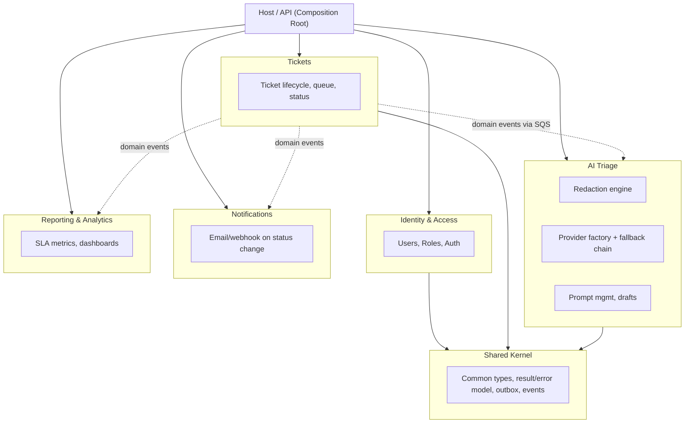

# Support Ticket Triage Platform — Architecture & Delivery Plan

**Stack:** .NET 8+ (Modular Monolith) · Angular (standalone, signals) · GitHub Actions · AWS

---

## 1. Guiding principles

- **Modular monolith, not microservices.** One deployable, strict internal boundaries. Extraction to services later should be possible without a rewrite.
- **Privacy by default, not by request.** Tickets are processed locally unless a user explicitly opts in to a third-party provider — and even then, only a redacted version leaves the building.
- **Boring where it doesn't matter, careful where it does.** The AI/triage module is the risky external dependency — it gets the most resilience investment.
- **Everything observable from day one.** Logs, traces, metrics, health checks are not "phase 2."
- **CI enforces the architecture**, not just code style — boundary violations fail the build.
- **Built to be run, not just read.** One-command local dev, IaC for every environment, a live demo link.

---

## 2. Module map



**Rule:** modules only talk to each other through (a) published contracts/interfaces in `Shared.Abstractions`, or (b) domain events. No module references another module's internals or database tables directly.

| Module | Owns | Talks to others via |
|---|---|---|
| Identity | Users, roles, permissions, login/refresh, provider preferences | Exposes `ICurrentUserAccessor`; others never touch its tables |
| Tickets | Ticket CRUD, status, queue, assignment | Publishes `TicketCreated`, `TicketTriaged`, `TicketResolved` (via SQS) |
| Triage | Redaction, LLM provider selection/fallback, stores triage result, drafts | Subscribes to `TicketCreated`; publishes `TicketTriaged` |
| Notifications | Emails / webhooks on events | Subscribes to ticket events only |
| Reporting | Read-model aggregation for dashboards | Subscribes to all ticket events; own read schema |

---

## 3. Solution structure (.NET)

```
/src
  /Host                        -> ASP.NET Core Web API, composition root, DI wiring, middleware
  /Modules
    /Tickets
      /Tickets.Domain           entities, value objects, domain events
      /Tickets.Application      CQRS handlers (MediatR), validators, DTOs
      /Tickets.Infrastructure   EF Core config, repositories, outbox, SQS publisher
      /Tickets.Contracts        public interfaces + events other modules can reference
    /Triage
      /Triage.Domain
      /Triage.Application       Redaction engine, provider factory, Polly policies, prompt templates
      /Triage.Infrastructure    Presidio client, Ollama/OpenAI/Anthropic/Gemini clients, SQS consumer (worker)
      /Triage.Contracts
    /Identity
      /Identity.Domain
      /Identity.Application
      /Identity.Infrastructure  ASP.NET Core Identity, JWT issuing
      /Identity.Contracts
    /Notifications
    /Reporting
  /Shared
    /Shared.Kernel              Result<T>, Error, Entity/AggregateRoot base, DomainEvent base
    /Shared.Abstractions         cross-module contracts (interfaces + event shapes only)
    /Shared.Infrastructure        outbox implementation, telemetry helpers, caching helpers
/tests
  /UnitTests/<Module>.Tests
  /IntegrationTests/<Module>.IntegrationTests
  /ArchitectureTests            NetArchTest rules enforcing module boundaries
  /E2ETests                     Playwright, run against a deployed environment
/frontend
  /apps/agent-console            Angular app
  /libs/ui                       shared Angular UI library
  /libs/data-access               typed API clients, generated from OpenAPI
/infra
  /terraform                     per-environment AWS infrastructure
/docs
  /adr                           architecture decision records
docker-compose.yml                full local stack in one command
```

**Why per-module Contracts projects:** other modules may only ever reference `X.Contracts`, never `X.Application` or `X.Infrastructure`. This is the seam you'd cut along if a module ever became its own service.

### Internal patterns per module
- **CQRS-lite** with MediatR: `Commands` (write, return `Result`) and `Queries` (read, can bypass domain model and query a read-model directly for performance).
- **FluentValidation** pipeline behavior runs before every command handler.
- **EF Core**, one `DbContext` per module, separate schema per module in a single database (simplest ops story while still enforcing logical separation; can split to separate databases later with minimal code change since each module already owns its schema).
- **Outbox pattern** for publishing domain events reliably: write event + business change in the same DB transaction, background dispatcher publishes and marks as sent. Prevents "saved ticket but notification lost" class of bugs.

---

## 4. Frontend (Angular)

- **Standalone components** (no NgModules), Angular signals for local/component state.
- **State management:** signals + a thin service layer per feature is enough for this domain size — avoid NgRx unless cross-cutting shared state grows complex. Revisit if reporting/dashboard state gets gnarly.
- **API client:** generate typed clients from the backend's OpenAPI spec (`openapi-typescript` or NSwag) — never hand-write HTTP calls, keeps FE/BE in sync and catches breaking changes at build time.
- **Structure:** feature-based folders (`features/tickets`, `features/triage-review`, `features/admin-users`), a shared `libs/ui` for design-system components, route-level lazy loading per feature.
- **Auth:** route guards (`canActivate`) checking role/permission claims from the decoded JWT; an `HttpInterceptor` attaches the bearer token and handles silent refresh + 401 redirect to login.
- **Provider preference UI:** per-user setting — default "Local (private)"; an explicit opt-in toggle per provider ("Allow sending redacted tickets to Claude/ChatGPT/Gemini for higher-quality triage"), with a visible badge on any ticket showing which provider actually triaged it, including a "local fallback used" indicator.
- **Accessibility:** WCAG 2.1 AA as a baseline — semantic HTML, keyboard navigation for the whole triage flow, ARIA labels on icon-only buttons (copy, resolve), visible focus states, color contrast checked for the priority stamp badges (don't rely on color alone — pair with the text label, which the design already does).
- **Testing:** Jest for unit tests (components/services), Playwright for E2E against a running stack.

---

## 5. Identity & roles

- **ASP.NET Core Identity** for user store + password hashing; issue **JWT access tokens** (short-lived, ~15 min) + **refresh tokens** (rotated, stored hashed, revocable).
- Consider **Entra ID / Auth0** instead of rolling your own if SSO is a near-term requirement — swapping the token issuer later is painful, deciding now is cheap.
- **Roles (policy-based, not just role-string checks):**

| Role | Can do |
|---|---|
| Agent | View/triage/respond to tickets, mark resolved, choose their own provider preference |
| Team Lead | All Agent permissions + reassign tickets, view team reporting |
| Admin | Manage users/roles, configure integrations, set org-wide provider policy (e.g. force local-only), full reporting |
| Viewer (optional) | Read-only, for stakeholders |

- Implement as **ASP.NET Core policies** (`[Authorize(Policy = "CanReassignTickets")]`) mapped to permissions, not raw role checks — lets you add fine-grained permissions later without touching controllers.
- Angular mirrors this with a `PermissionsService` reading claims, used by both route guards and `*ngIf`-style directives to hide UI.

---

## 6. PII redaction & multi-provider LLM strategy

### What counts as PII here
Names, email addresses, phone numbers, physical addresses, account/card numbers, IP addresses — plus indirect mentions embedded in free text ("my daughter Sarah's account"), which structured field-level redaction alone won't catch.

### Default flow: local-first, redact, opt-in escalation

```
Ticket created
      |
      v
Redaction engine (always runs, on every ticket, regardless of provider)
  |- Microsoft Presidio (regex + NER) -- primary, deterministic pass
  `- Ollama secondary pass -- catches semantic/contextual PII regex misses
  -> masked ticket + local-only mapping table (never leaves the server)
      |
      v
User's provider preference?
      |
      |-- Local (default) --------------> Ollama triages the masked ticket, nothing leaves infra
      |
      `-- Opted in to OpenAI/Claude/Gemini
              |
              v
        masked ticket sent to chosen provider
              |
              v
        response rehydrated locally (placeholders -> real values)
              |
              v
        Polly retry -> circuit breaker -> timeout
              |
              v (all attempts fail)
        Falls back to local Ollama automatically, ticket still gets triaged
```

**Why Presidio + Ollama, not Ollama alone:** an LLM asked to redact PII can miss things (false negatives), and a missed PII leak is a materially worse failure than over-redacting a harmless word. Presidio's regex/NER is deterministic and precision-tuned for structured PII (emails, cards, phones); Ollama is the supplementary net for free-text mentions Presidio's patterns don't cover. Union both sets of detected spans before masking.

**Provider abstraction (unchanged core shape):**
```
ITriageLlmClient
  Task<TriageResult> TriageAsync(TicketContent ticket, CancellationToken ct)
```
Each provider (`OllamaTriageClient`, `OpenAiTriageClient`, `AnthropicTriageClient`, `GeminiTriageClient`) implements this. Registered as **keyed services** (.NET 8+), resolved via a `LlmProviderFactory` based on the user's preference. A `FallbackTriageClient` decorator wraps the chosen client and falls through to Ollama on failure — Ollama itself has no further fallback; it's the floor.

**Per-provider config that differs:**
- Polly policy — cloud providers get rate-limit-aware retry (respect `Retry-After`); Ollama gets a longer timeout, no rate limiting.
- Secrets — API keys in AWS Secrets Manager, keyed per provider, per environment.
- Prompt/schema — open models benefit from JSON-schema-constrained generation (llama.cpp/vLLM support this) for reliable structured output.
- Telemetry — tag every triage span/metric with `provider` and `wasFallback: true/false`. This becomes your most useful dashboard: fallback rate per provider, catching a degraded cloud provider before an agent complains.

**Surfacing, not hiding, the source:** every triaged ticket shows which provider actually produced the result, including when fallback silently kicked in. Agents should know if they're looking at a local vs. cloud result, especially while trust in the local model's output is still being built.

---

## 7. Async processing

Triage should not happen synchronously inside the ticket-creation request — a slow LLM (local or cloud) shouldn't hold an HTTP request open.

- **Ticket ingestion** (`POST /tickets`) validates, saves, publishes `TicketCreated` via the outbox, and **returns immediately** — status `new`, "not yet triaged."
- **Triage worker** — a background consumer (hosted service or separate ECS task) subscribed to **AWS SQS**, picks up `TicketCreated`, runs redaction, then provider selection, then the LLM call, then publishes `TicketTriaged`.
- **Idempotency:** SQS can redeliver; the worker checks the ticket's current status before processing so a redelivered message is a safe no-op if already triaged.
- **Dead-letter queue** for messages that fail repeatedly (e.g. malformed ticket data) — surfaced as an alert, not silently dropped.
- This also directly demonstrates event-driven architecture and pairs naturally with the outbox pattern already in place.

---

## 8. Resilience

The LLM call is the single least reliable dependency in the system — treat it accordingly.

- **Polly policies** around every triage LLM client:
  - Timeout (e.g. 15s cloud, longer for local inference) so a hung call doesn't block a worker thread.
  - Retry with exponential backoff + jitter (2-3 attempts) for transient failures.
  - Circuit breaker so a failing provider doesn't get hammered by every incoming ticket.
  - Bulkhead/concurrency limiter so triage load can't starve the rest of the API's thread pool or the local GPU.
- **Graceful degradation:** if triage fails after retries (including the Ollama fallback), the ticket still lands in the queue as "not triaged" rather than failing silently — an agent can retry manually or a background job retries later.
- **Idempotency:** both ticket ingestion and the triage worker are idempotent (see async processing above).
- **Outbox + background dispatcher** decouples "ticket saved" from "event published/notification sent."
- **Rate limiting** at the API middleware level (ASP.NET Core's built-in rate limiter) to protect against ingestion floods.
- **Health checks:** `/health/live` (process is up) and `/health/ready` (DB, SQS, LLM provider reachability, outbox dispatcher running) via `AspNetCore.HealthChecks`.

---

## 9. Observability

- **Structured logging:** Serilog, JSON output, enriched with correlation ID, user ID, module name, provider name. Sink to Seq (simple/self-hosted) or CloudWatch Logs / ELK depending on environment.
- **Distributed tracing:** OpenTelemetry SDK, auto-instrument ASP.NET Core + EF Core + HttpClient (so both the redaction pass and the LLM call show up as traced spans with latency), export to AWS X-Ray, Tempo, or Jaeger.
- **Metrics:** OpenTelemetry Metrics — request rates/latency/error rate per module, plus domain-specific metrics: tickets triaged/hour, average triage latency per provider, fallback rate, redaction pass duration, queue depth (SQS). Export to CloudWatch Metrics or Prometheus/Grafana.
- **Correlation ID middleware:** generate/propagate `X-Correlation-Id` from Angular through the API, into the SQS message, and into every log line — traceable end to end including the async hop.
- **Frontend:** basic error/telemetry capture (Sentry or similar) so FE exceptions and slow API calls are visible too, not just backend.
- **Cost awareness:** tag cloud LLM spend per provider/environment; AWS Budgets alert if a provider's spend spikes unexpectedly (e.g. a fallback loop hammering a provider before the circuit breaker opens).

---

## 10. Testing strategy

| Layer | Tooling | What it covers |
|---|---|---|
| Unit | xUnit + NSubstitute/Moq + FluentAssertions | Domain logic, command/query handlers with mocked infrastructure |
| Integration | xUnit + `WebApplicationFactory` + Testcontainers (real Postgres/SQL Server + LocalStack for SQS) | Module's API endpoints against real infra, EF mappings, outbox behavior |
| Architecture | NetArchTest (or ArchUnitNET) | Enforces "module X cannot reference module Y's Infrastructure/Application" as a failing test |
| Contract | Pact or simple OpenAPI diff check in CI | Frontend's generated client stays in sync with backend contract |
| PII / redaction | Dedicated test suite with a fixture set of known PII patterns | Asserts Presidio + Ollama union catches known name/email/phone/card patterns; regression suite grows every time a miss is found |
| Frontend unit | Jest | Components, pipes, services in isolation |
| E2E | Playwright | Critical flows: login, view queue, opt in to a provider, triage a ticket, mark resolved, role-based access, accessibility checks (axe-core integration) |
| Resilience | Chaos-style test harness (optional, later) | Simulate LLM timeout/5xx and assert graceful degradation + fallback actually work |

**Coverage gate in CI:** enforce a minimum threshold (e.g. 70-80%) on `Domain` and `Application` layers specifically, not a blanket repo-wide number that punishes generated/infrastructure code.

---

## 11. CI/CD (GitHub Actions)

**Pipeline shape:**

1. **`ci.yml`** — runs on every PR:
   - Restore/build (.NET), install (Angular)
   - Lint (dotnet format check, ESLint)
   - Unit tests + coverage (both stacks)
   - Architecture tests (fails fast if module boundaries are violated)
   - Integration tests (Testcontainers + LocalStack)
   - Secrets scanning (gitleaks) and dependency scanning (CodeQL, `dotnet list package --vulnerable`, `npm audit`, Dependabot alerts)
   - `terraform plan` on infra PRs
   - Build & publish Docker image (tagged with commit SHA) as an artifact, not yet deployed

2. **`deploy-dev.yml`** — on merge to `main`: reuses the CI-built image, deploys to `dev` automatically (via Terraform-managed ECS), runs Playwright E2E against `dev`.

3. **`deploy-staging.yml` / `deploy-prod.yml`**: manual approval gate (GitHub Environments with required reviewers), same image promoted forward, smoke tests + health check verification post-deploy, automatic rollback on health check failure.

**Illustrative snippet (CI job outline, not exhaustive):**

```yaml
name: CI
on:
  pull_request:
    branches: [main]

jobs:
  backend:
    runs-on: ubuntu-latest
    steps:
      - uses: actions/checkout@v4
      - uses: actions/setup-dotnet@v4
        with:
          dotnet-version: '8.0.x'
      - run: dotnet restore
      - run: dotnet format --verify-no-changes
      - run: dotnet build --no-restore -c Release
      - run: dotnet test tests/ArchitectureTests --no-build
      - run: dotnet test tests/UnitTests --no-build --collect:"XPlat Code Coverage"
      - run: dotnet test tests/IntegrationTests --no-build   # Testcontainers + LocalStack

  frontend:
    runs-on: ubuntu-latest
    steps:
      - uses: actions/checkout@v4
      - uses: actions/setup-node@v4
        with:
          node-version: '20'
      - run: npm ci
        working-directory: frontend
      - run: npm run lint
        working-directory: frontend
      - run: npm run test -- --ci --coverage
        working-directory: frontend
      - run: npm run build
        working-directory: frontend

  security:
    runs-on: ubuntu-latest
    steps:
      - uses: actions/checkout@v4
      - uses: gitleaks/gitleaks-action@v2
      - uses: github/codeql-action/init@v3
      - uses: github/codeql-action/analyze@v3

  infra-plan:
    runs-on: ubuntu-latest
    steps:
      - uses: actions/checkout@v4
      - uses: hashicorp/setup-terraform@v3
      - run: terraform plan
        working-directory: infra/terraform/envs/dev
```

Use **branch protection** requiring all of the above green + at least one review before merge to `main`.

---

## 12. Infrastructure as Code

- **Terraform**, one root module per environment (`infra/terraform/envs/dev`, `staging`, `prod`), sharing common modules (`vpc`, `ecs-service`, `rds`, `secrets`, `sqs`) to avoid drift between environments.
- State stored remotely (S3 backend + DynamoDB lock table) — never local state.
- Provisions per environment: VPC, ECS Fargate service(s), RDS instance, SQS queues + DLQ, Secrets Manager entries, CloudFront + S3 for the Angular build, IAM roles scoped per service (least privilege).
- `terraform plan` runs in CI on every infra PR; `apply` gated the same way as app deploys (manual approval for staging/prod).

---

## 13. Local dev experience

A single `docker-compose.yml` at the repo root spins up:
- The .NET API (or run natively via `dotnet watch` and only containerize dependencies — either works, document whichever you pick)
- Postgres
- Ollama (with the triage model pulled via an init step)
- LocalStack (mocks SQS/Secrets Manager locally so cloud dependencies aren't required to develop)
- Angular dev server

Goal: `docker compose up` and the whole stack is runnable in under five minutes with no AWS account needed. This is one of the highest-leverage things for a portfolio piece — reviewers actually try to run projects, and a smooth first run matters more than most code quality details.

---

## 14. Environments & AWS topology — ephemeral by design

For a solo portfolio project, **environments don't need to exist continuously.** The pattern here is: local dev is where you actually build (docker-compose, always on, free); AWS environments are **stood up on demand, used, recorded, then torn down.**

- **Local (docker-compose)** — where 95% of development happens. Free, instant, no AWS account touched.
- **Dev on AWS** — spun up only when you specifically want to validate the real CI/CD → Terraform → ECS path works, not kept running between sessions. Since Terraform owns everything, `terraform apply` recreates it identically each time — there's no "environment drift" risk from tearing it down.
- **Staging/"Demo" on AWS** — stood up per **stage** (see build order below) specifically to record the milestone demo, then torn down (`terraform destroy`) the same day. This is the one that matters most for the CV — it's the thing in the recording.
- **Production** — for a personal project, you likely don't need an always-on "production" at all. If you want one live link that's always reachable (rather than just a recording), that's the *one* environment worth possibly leaving on, and even then, consider scaling it to the cheapest possible always-on shape (see cost plan) or only turning it on when someone's actually about to look at it.

**UAT/SIT** — still deliberately excluded, same reasoning as before: no separate business-stakeholder audience, and the automated test suite already covers what SIT would.

**Mechanics of the deploy → record → teardown cycle:**
1. Tag the commit for the stage (`git tag v0.3-multi-provider`).
2. `terraform apply` against that stage's environment — everything comes up from code, nothing hand-configured in the console.
3. Run through the demo flow, capture the screen recording.
4. Run smoke tests / grab any logs or screenshots you want for the README.
5. `terraform destroy` — infra gone, cost stops accruing.
6. Commit the recording + updated README/ADR to the repo. The recording *becomes* your "live demo" — a static asset, not a running service, which is what keeps AWS spend near zero between milestones.

This is genuinely worth stating explicitly in your README/ADRs: "environments are provisioned on demand via Terraform and torn down after use" is a real, defensible operational choice — not a limitation you need to apologize for.

**AWS services used (only while an environment is up):**
- ECS Fargate for the API + worker; Angular static build to S3 + CloudFront (S3+CloudFront can actually stay up permanently for near-zero cost if you want one always-reachable link — see cost plan)
- RDS (Postgres), or consider `pg` in a single Fargate task for a demo-only environment to skip RDS's per-hour cost entirely
- SQS + DLQ for the triage event pipeline
- Secrets Manager for API keys (OpenAI/Claude/Gemini), JWT signing keys
- ElastiCache (Redis) — skip for early stages; add only once the Reporting/caching stage is being demoed specifically
- CloudWatch for logs/metrics, X-Ray for tracing
- GitHub Environments map to these, with environment-scoped secrets and required reviewers gating anything that costs money to stand up

---

## 15. Branching strategy

**Trunk-based development, short-lived feature branches** — fits the build-once-promote-forward model; GitFlow's long-lived branches would fight against it.

- **`main` is always deployable**; every merge auto-deploys to Dev.
- **Feature branches**, short-lived (1-3 days): `feature/…`, `fix/…`, `chore/…`, `spike/…`. Branch off `main`, PR back into `main`.
- **No environment-named branches.** Promotion happens by tagging a commit and deploying that exact built image forward — not by merging into a `staging` or `prod` branch (which drift out of sync with each other over time).
- **PRs scoped to one module** where possible — the module boundaries make this a natural size limit.
- **CI gate + one required review** before merge; architecture tests must pass.
- **Feature flags** for anything unfinished/risky (e.g. a new provider integration) merged behind a flag rather than kept on a long branch — this is what actually makes short-lived branches sustainable.
- **Hotfixes** branch off the tag currently in prod, not off `main` (which may have moved on), merge back to `main` normally, fast-tracked through the pipeline.

---

## 16. API documentation

- **OpenAPI/Swagger** exposed from the API (`Swashbuckle` or built-in .NET 8 OpenAPI support) at `/swagger` in non-prod environments.
- Angular's typed API client (section 4) is generated directly from this spec — one source of truth, breaking changes caught at build time rather than at runtime.
- Cheap to add, very visible in a demo/portfolio context.

---

## 17. Caching

- **Redis (ElastiCache)** for:
  - Duplicate/similar-ticket triage result caching — if the same or near-identical ticket text comes in twice, skip a redundant LLM call.
  - Reporting module's read-model queries — dashboards don't need to hit the DB on every load.
- Modest addition, but signals attention to performance, not just correctness.

---

## 18. Security

- **CORS** — explicit allowed origins per environment, never a wildcard in staging/prod.
- **Security headers** — CSP, HSTS, X-Content-Type-Options, via middleware.
- **Secrets scanning in CI** — gitleaks or truffleHog on every PR, catches accidentally committed keys before merge.
- **Dependency scanning** — Dependabot enabled for both NuGet and npm, plus CodeQL/`dotnet list package --vulnerable`/`npm audit` already in the CI pipeline.
- **Least-privilege IAM** per ECS task/service (from the Terraform modules), not one broad role shared across everything.

---

## 19. Presentation (the part that gets you the interview)

- **README** with: the mermaid architecture diagram, one-command local setup (`docker compose up`), a short "why these choices" section (modular monolith over microservices, local-first LLM, trunk-based branching) — the reasoning is what gets discussed, not just the tech list.
- **ADRs** in `/docs/adr` — short markdown files per significant decision, e.g.:
  - `001-modular-monolith-over-microservices.md`
  - `002-local-first-llm-with-opt-in-cloud-fallback.md`
  - `003-presidio-plus-llm-for-pii-redaction.md`
  - `004-trunk-based-branching-and-promote-forward-deploys.md`

  Each: context, decision, tradeoffs considered, why this one won. This is the single highest-signal artifact for interviews.
- **Screen recording per stage** (60-90s each, or one longer edited walkthrough) — since environments are ephemeral, this recording *is* the demo most reviewers will see. Host on the README (GIF or embedded video link) rather than relying on a live link that may be torn down. If you want one always-clickable thing, the S3+CloudFront-hosted frontend can stay up cheaply even with the backend down — showing the UI with a "backend demo in video below" note is a reasonable middle ground.

---

## 20. Staged delivery — Stage 0 is the MVP, everything after is optional

Each stage ends with: tag → `terraform apply` → demo + record → smoke test → `terraform destroy`. Nothing stays up between stages. **Stage 0 is the complete, deployable, demo-able project.** Every stage after it is an independent add-on — none are required for the project to "count."

### Stage 0 — MVP (the whole thing, minimum viable)
This is the walking skeleton and the usable demo combined — proves the pipeline and gives you something worth showing, in one stage:
- Host + Identity module: login, JWT, Agent + Admin roles only (skip Team Lead/Viewer)
- Tickets module: create/view/list, queue, status (CRUD, no reassignment yet)
- Triage, local-only: Presidio + Ollama redaction, Ollama triage, basic Polly resilience, async via SQS
- Angular: login, ticket queue, ticket detail, triage button, draft reply view
- `docker-compose.yml` working locally; GitHub Actions CI green (unit + integration + architecture tests)
- First Terraform apply, real AWS deploy of the above, health checks green
- **Deploy, record a full walkthrough, tear down. This recording is your primary CV demo — everything below is optional depth on top of it.**

---

### Optional add-on stages (independent, do any subset, in any order)

**Add-on A — Multi-provider + resilience depth**
- OpenAI/Claude/Gemini clients behind the same interface, opt-in UI, fallback chain to Ollama
- Full Polly policy set (circuit breaker, bulkhead), provider telemetry tagging
- Health checks, correlation IDs
- **Deploy, record the "opt in to Claude, watch it fall back to local on simulated failure" demo — the most interesting technical story, worth its own clip.**

**Add-on B — Observability & hardening**
- OpenTelemetry tracing + metrics, Serilog structured logging, dashboards
- Security pass: CORS, headers, secrets/dependency scanning in CI
- Caching (Redis) if demoed live; otherwise fine to describe as designed-but-not-built
- **Deploy, record a trace through the system (ticket → redaction → LLM call → response) — visual, demo-able.**

**Add-on C — Notifications & Reporting**
- Notifications module (email on triage-complete/resolved)
- Reporting module + dashboards, once enough sample data exists to make charts meaningful
- Fine to describe as "designed, partially built" if you never get here.

**Add-on D — Presentation polish**
README, ADRs, accessibility pass, stitched final walkthrough video, architecture diagram cleanup. No new AWS deploy needed — entirely about the repo and recordings you already have. Worth doing even if A-C are skipped, since it's what makes Stage 0 alone look intentional rather than unfinished.

**If you stop at Stage 0:** it's still a complete, coherent story — working app, real cloud deploy, PII-aware local-first design. Add-ons are purely about raising the ceiling, not completing something that's otherwise missing.

### Stretch stages — senior-signal (optional, pick and choose, on top of Stage 0 + any add-ons)

These aren't required to look "finished" — Stage 0 alone already is. They exist specifically to push the project from mid-level to mid-senior/senior signal. Each is independent; do as many as time allows, in roughly this priority order.

**S1 — Extract a module as a real service.** Pull Triage out of the monolith, deploy it standalone (separate ECS service, HTTP/gRPC boundary where the in-process contract used to be). Write the ADR on what broke and what changed. *Highest-value single stretch item — turns "this could be a microservice" from a claim into evidence.*

**S2 — LLM eval harness.** ~30-50 fixed sample tickets with expected category/priority/summary quality, scored automatically per provider, run in CI whenever a prompt or provider changes. *Second-highest value — very few candidates think to test AI output quality as a regression suite rather than eyeballing a demo.*

**S3 — Load test with a real writeup.** k6 (or similar) against the Stage 0 deploy: concurrent ticket ingestion, observe SQS queue depth, Ollama latency under concurrency, the point the circuit breaker actually trips. Document what broke and the fix you'd make, not just that it "should" hold up.

**S4 — RFCs for the decisions that had real alternatives.** Written *before* deciding, not after — e.g. "redact-then-triage locally vs. triage raw locally and only redact on cloud escalation," with explicit tradeoffs, then the decision. Different from the ADRs already planned (section 19): RFCs show the reasoning process, ADRs record the outcome.

**S5 — Threat model for the AI boundary.** Short STRIDE-style pass specifically on prompt injection risk (e.g. a ticket body trying to manipulate the LLM into mislabeling itself urgent, or leaking the redaction mapping table) — detection/mitigation approach, even if partial.

**S6 — Simulated incident + blameless postmortem.** Deliberately break something in a torn-up-after demo environment (kill Ollama mid-triage, corrupt a DLQ message), observe it through your own logging/tracing, write root cause + follow-ups.

**S7 — One hard concurrency problem, explained.** E.g. two workers racing on a redelivered SQS message — walk through the race in a naive version and why the idempotency check actually closes it, not just that it exists.

**Suggested allocation if you only have a little extra time:** S1 and S2 alone meaningfully shift the project's ceiling — do those two first if nothing else.

---

## 21. AWS cost plan

Rough estimates, US pricing, on-demand rates (July 2026 ballpark — verify current pricing before committing, AWS pricing pages are the source of truth). Numbers are per-service; combine per stage below.

| Service | Shape for this project | Cost while running | Notes |
|---|---|---|---|
| ECS Fargate (API + worker) | 2 tasks, 0.5 vCPU/1GB each | ~$0.02-0.03/hr combined | Use **Fargate Spot** for non-prod demo runs — up to 70% cheaper |
| RDS Postgres | `db.t4g.micro`, single-AZ | ~$0.016/hr (~$12/mo if left on) | Skip entirely for early-stage demos — run Postgres in a Fargate task instead, or use SQLite for Stage 0 |
| NAT Gateway | 1 per AZ | ~$0.045/hr **+ data processing**, this is the classic silent cost | For a demo VPC: put ECS tasks in **public subnets with locked-down security groups** instead of paying for NAT, or use a single NAT instance (EC2 t4g.nano, ~$0.003/hr) instead of managed NAT Gateway |
| SQS | Pay per request | Negligible (~$0.0000004/request) | Effectively free at demo volume |
| Secrets Manager | Per secret per month | ~$0.40/secret/month, prorated | A handful of secrets = cents for a few days |
| S3 + CloudFront (Angular build) | Static hosting | Near-zero; a few cents/month even left on permanently | Reasonable to leave this one always-on |
| GPU instance for local Ollama in cloud (optional) | `g4dn.xlarge` | ~$0.526/hr on-demand | **Only spin this up for the actual recording session**, terminate immediately after — this is the single most expensive line item by far if left running |
| CloudWatch Logs/Metrics | Pay per GB ingested | A few cents for a short demo session | Fine |
| Data transfer out | Minimal for a demo | Usually a few cents | Fine |

**Estimated cost per stage demo session** (spin up, record for ~1-2 hours, tear down): **roughly $1-3**, dominated by the GPU instance if you run Ollama in the cloud for the recording — or **well under $1** if you demo the local-LLM parts against your own machine/docker-compose and only deploy the cloud-provider path to AWS.

**Estimated cost if you left Stage-1-equivalent infra running 24/7 for a month** (for contrast, to justify why you're *not* doing this): Fargate (~$15-20) + RDS (~$12) + NAT Gateway (~$35-50 including data processing) + GPU instance if always-on (~$380) ≈ **$60-450+/month** depending mainly on whether Ollama runs on a GPU box continuously. This comparison is worth including in your README as the explicit reason for the deploy/record/teardown pattern — it reads as cost-conscious engineering judgment, not corner-cutting.

**Cheapest way to keep one thing always reachable:** S3 + CloudFront hosting the Angular frontend alone, pointed at a "backend demo" video/GIF instead of a live API — effectively free, always up, no teardown needed.

**Practical safety net:** set an **AWS Budget alert** (e.g. $10/month threshold) from day one, regardless of how careful the teardown discipline is — catches a forgotten `terraform destroy` before it becomes a surprise bill.

---

## Open questions worth deciding early

- Single database with per-module schemas, or separate databases per module from day one? (Recommend: single DB/schemas — simpler ops, same code either way.)
- Roll-your-own Identity vs. Entra ID/Auth0 — depends on whether SSO with a customer's IdP is a near-term requirement.
- Deployment target within AWS: ECS Fargate (simplest, recommended here) vs. EKS (only if you specifically want Kubernetes experience on the CV — otherwise added complexity without added learning value for this project).
- Should the Ollama secondary redaction pass run on every ticket, or only be triggered when Presidio's confidence is low / for ticket types known to contain more free-text PII? Worth measuring before deciding — start with "always," optimize if latency becomes a problem.
